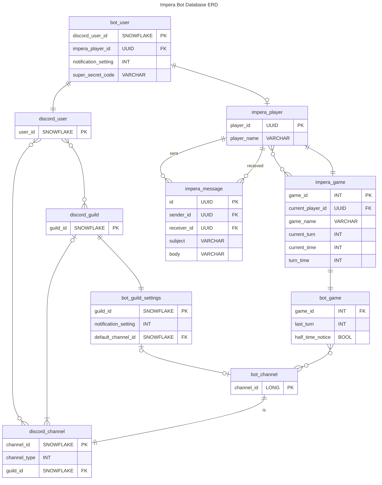

```mermaid
---
title: Impera Bot Database ERD
---
erDiagram
    bot_user ||--|o impera_player: ""
    impera_game ||--|| bot_game: ""
    impera_player }o--o{ impera_game: ""
    discord_guild ||--|| bot_guild_settings: ""
    impera_player ||--o{ impera_message: "sent"
    impera_message }o--|| impera_player: "recieved"
    impera_game ||--|| impera_player: ""
    discord_user }o--o{ discord_channel: ""
    bot_user ||--|| discord_user: ""
    discord_guild |o--|{ discord_channel: ""
    discord_user }o--o{ discord_guild: ""
    bot_channel ||--|| discord_channel: "is"
    bot_guild_settings |o--o| bot_channel: ""
    bot_game }o--o{ bot_channel: ""

    bot_game {
        game_id INT FK
        last_turn INT
        half_time_notice BOOL
    }
    bot_user {
        discord_user_id SNOWFLAKE PK
        impera_player_id UUID FK
        notification_setting INT
        super_secret_code VARCHAR
    }
    impera_player {
        player_id UUID PK
        player_name VARCHAR
    }
    discord_user {
        user_id SNOWFLAKE PK
    }
    impera_game {
        game_id INT PK
        current_player_id UUID FK
        game_name VARCHAR
        current_turn INT
        current_time INT
        turn_time INT
    }
    bot_channel {
        channel_id LONG PK
    }
    discord_channel {
        channel_id SNOWFLAKE PK
        channel_type INT
        guild_id SNOWFLAKE FK
    }
    discord_guild {
        guild_id SNOWFLAKE PK
    }
    bot_guild_settings {
        guild_id SNOWFLAKE PK
        notification_setting INT
        default_channel_id SNOWFLAKE FK
    }
    impera_message {
        id UUID PK
        sender_id UUID FK
        receiver_id UUID FK
        subject VARCHAR
        body VARCHAR
    }

```