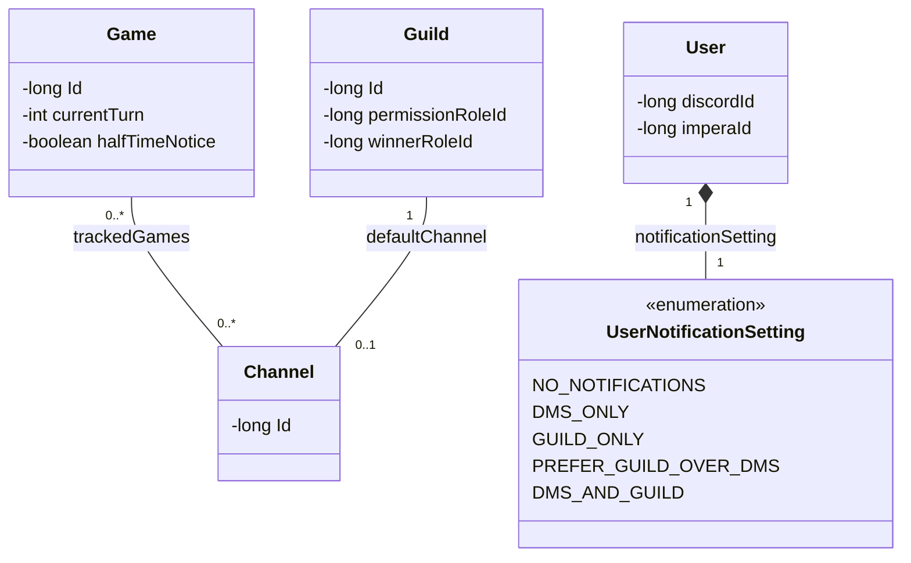

```mermaid

classDiagram
    class Game {
        -long Id
        -int currentTurn
        -boolean halfTimeNotice
    }
    class User {
        -long discordId
        -long imperaId
    }
    class Channel {
        -long Id
    }
    class Guild {
        -long Id
        -long permissionRoleId
        -long winnerRoleId
    }
    class UserNotificationSetting {
        <<enumeration>>
        NO_NOTIFICATIONS
        DMS_ONLY
        GUILD_ONLY
        PREFER_GUILD_OVER_DMS
        DMS_AND_GUILD
    }

    Game "0..*" -- "0..*" Channel: trackedGames
    Guild "1" -- "0..1" Channel: defaultChannel
    User "1" *-- "1" UserNotificationSetting: notificationSetting
```